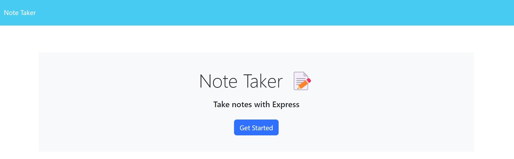
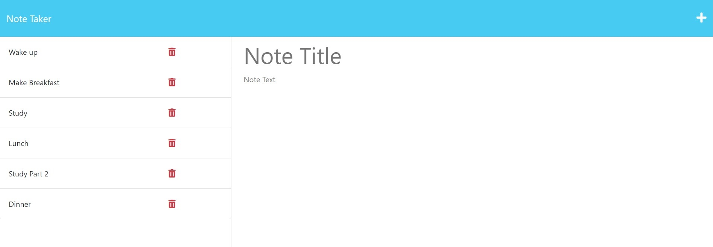
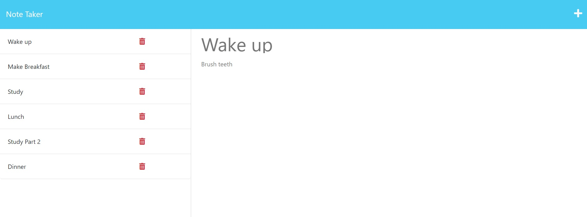
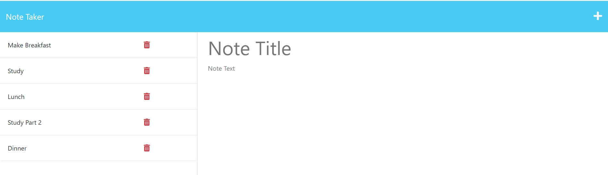
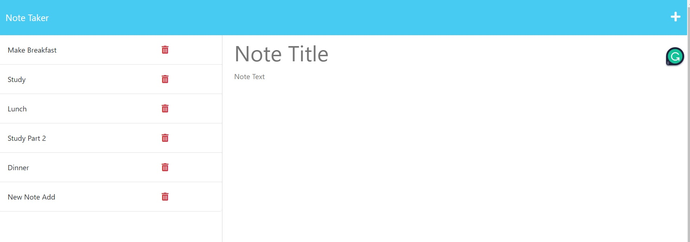

# Note Taker

## Description

Created a note taking application. You can enter and save notes than have a title and description, view previously entered notes, and delete notes from the list of added notes.

Published website:  https://immense-ocean-93337.herokuapp.com/notes

## Installation

N/A

## Usage

Visit Kevin Molyneaux's Note Taker application and keep yourself organized. 

## Credits

N/A

## License

MIT License - Please refer to the LICENSE in the repo.

## Usage
The following image shows the Note Taker home page: 

The follwing image shows the notes page with a list of added notes:

The following image shows the notes page with the Wake up note being previewed to show the detail within: 

The following image shows the notes list after the note titled 'Wake Up' was deleted: 

The following image shows the notes list after a new note has been added: 

